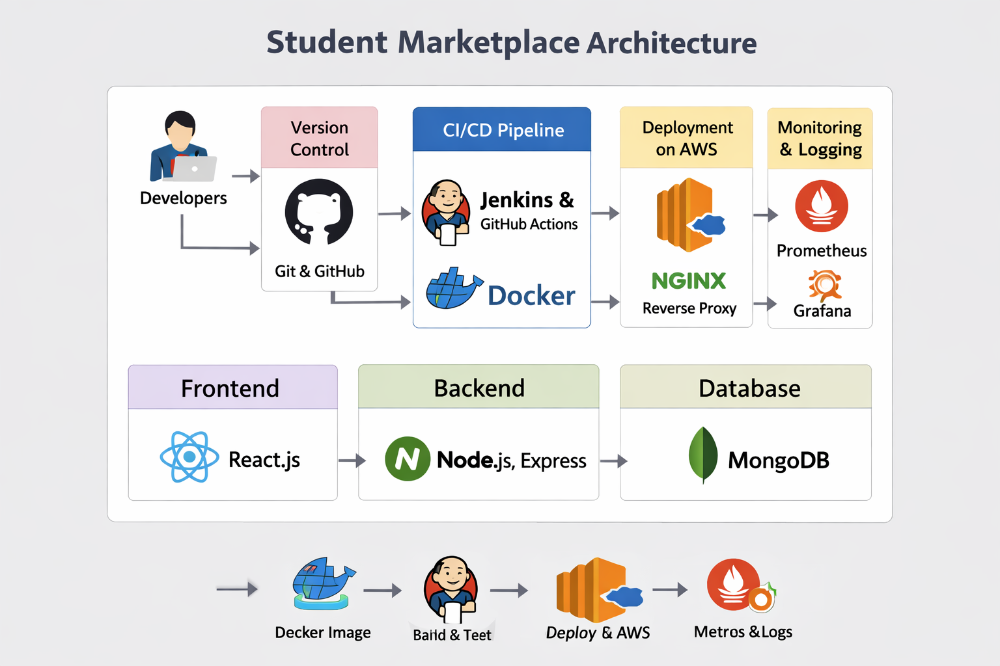
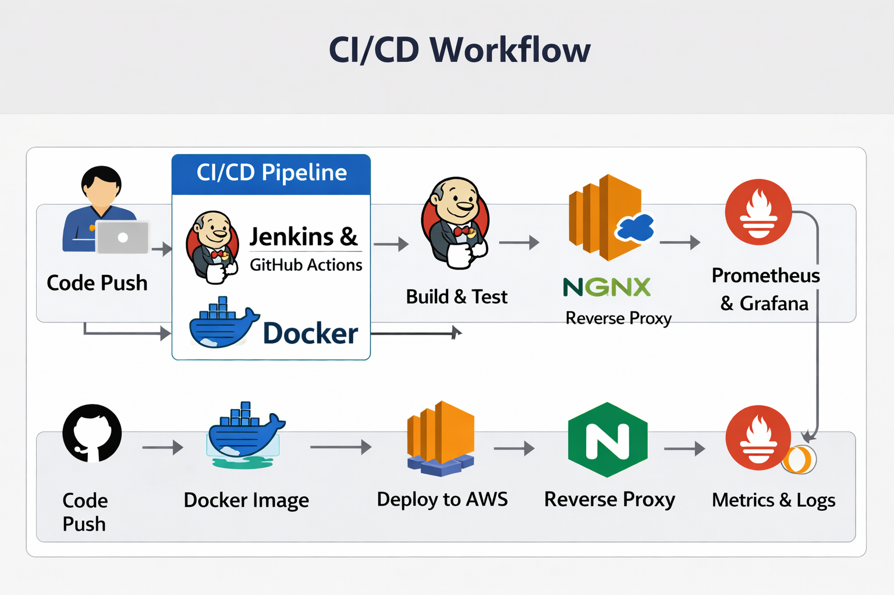

# 🎓 Student Marketplace Platform

## 👨‍💻 Team Members
- Pranav Yadav
- Kamran Javeed
- Bingi Likhil Chandra

## 📌 Description
A web-based platform where students can buy, sell, and exchange items like books, electronics, and study materials within their campus.

## 🚀 Features
- User Authentication
- Product Listing
- Search & Filter
- Contact Seller

## 🛠 Tech Stack
- Frontend: React.js
- Backend: Node.js, Express
- Database: MongoDB

## 📂 Project Structure
```
student-marketplace/
│
├── docs/
│ ├── synopsis.md
│ ├── architecture.png
│ └── workflow.png
│
├── frontend/
├── backend/
│
└── README.md
```


---

## 📊 Diagrams

### 🏗 Architecture Diagram


### 🔄 Workflow Diagram


---

## 🔄 Working Flow
1. User registers and logs into the system  
2. User can add products for sale  
3. Other users browse or search products  
4. Interested buyer contacts the seller  
5. Transaction is completed between users  

---

## 🔮 Future Scope
- Online payment integration  
- Chat system between users  
- Rating and review system  
- Mobile application development  

---

## ⚙️ Setup Instructions
1. Clone the repository

   git clone https://github.com/Pranavyadav12345/student-marketplace.git


2. Navigate to project folder
3. Install dependencies -> npm install
4. Run the application  -> npm start 
